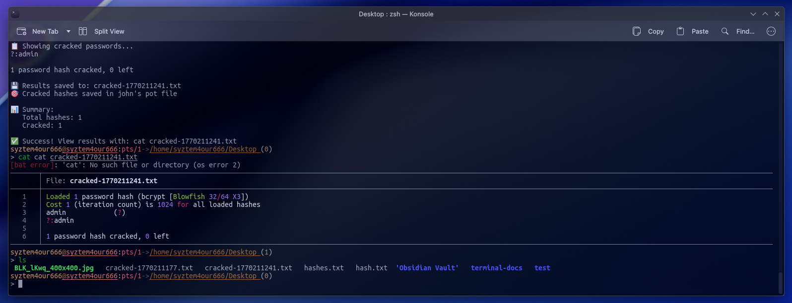

# 🔥 Pentesting ZSH Functions

> A curated collection of powerful ZSH functions designed for penetration testers, CTF players, and security researchers who value speed and efficiency.


---

## 📋 Overview

This repository contains a comprehensive suite of ZSH functions that streamline common penetration testing and CTF workflows. Each function is crafted to minimize keystrokes while maximizing efficiency, allowing you to focus on the actual security work rather than remembering complex command syntax.

All functions feature:
- 🎨 **Visual feedback** with emojis for better readability
- ⚡ **Automated workflows** that combine multiple steps
- 📁 **Organized output** with timestamped files
- 🛡️ **Error handling** with helpful usage messages

---

## ✨ Key Features

### Network Reconnaissance
Fast and efficient network scanning with automated result display. Perfect for initial enumeration phases where you need quick insights into your target's attack surface.

### Web Enumeration
Directory brute-forcing and fuzzing capabilities that automatically organize results and use sensible defaults while remaining fully customizable.

### Hash Cracking
Intelligent hash identification and cracking with automatic wordlist detection. The system handles the heavy lifting of hash type detection and provides clear cracking statistics.

### Environment Setup
One-command workspace initialization that creates a standardized directory structure for organizing scans, files, credentials, and exploits.

### Network Information
Beautiful IP address visualization showing local, VPN, and public IP addresses at a glance, with full network interface details.

### Utility Functions
Time-saving helpers for encoding/decoding, reverse shell generation, file extraction, and privilege escalation enumeration.

---

## 🚀 Installation

### Quick Install

1. **Clone the repository:**
   ```bash
   git clone https://github.com/yourusername/pentest-zsh-functions.git
   cd pentest-zsh-functions
   ```

2. **Source the functions in your `.zshrc`:**
   ```bash
   echo "source $(pwd)/functions.zsh" >> ~/.zshrc
   source ~/.zshrc
   ```

### Manual Install

Copy individual function files to your preferred location and source them in your `.zshrc`:
```bash
source ~/.pentest-functions/nmapfast.zsh
source ~/.pentest-functions/crack.zsh
source ~/.pentest-functions/ctfsetup.zsh
```

---

## 📚 Function Reference

### 🎯 Network Scanning

**Fast Nmap Scan**
- Combines service detection, version enumeration, and default scripts
- Automatically displays results after scanning
- Saves output for documentation

**All Ports Scan**
- Comprehensive scan of all 65,535 ports
- High-speed scanning with optimized rate limiting
- Organized output files

**UDP Scan**
- Top 100 UDP ports enumeration
- Requires sudo privileges
- Critical for finding hidden services

**Vulnerability Scan**
- NSE vulnerability script automation
- Comprehensive service fingerprinting
- Detailed vulnerability reporting

### 🌐 Web Application Testing

**Directory Enumeration**
- Gobuster integration with optimized threading
- Supports custom wordlists
- Clean, readable output format

**Web Fuzzing**
- FFUF integration for parameter discovery
- Automatic filtering of false positives
- Markdown output for documentation

### 🔓 Credential Operations

**Automated Hash Cracking**
- Intelligent hash type identification
- Automatic wordlist discovery
- Progress tracking and statistics
- Saves cracked passwords with timestamps

### 📁 Workspace Management

**CTF Directory Setup**
- Creates standardized folder structure
- Instant workspace organization
- Perfect for HTB, CTF competitions, and engagements

### 🌐 Network Information

**IP Address Display**
- Local IP detection
- VPN status monitoring (tun0)
- Public IP retrieval
- Complete interface listing
- Batcat integration for syntax highlighting

---

## 🎓 Usage Examples

### Quick Start Workflow

**Initialize your workspace:**
```bash
ctfsetup
```

**Scan your target:**
```bash
nmapfast 10.10.10.10
```

**Check your network status:**
```bash
myip
```

**Crack captured hashes:**
```bash
crack hashes.txt
```

### Advanced Scenarios

**Complete enumeration workflow:**
1. Set up workspace with `ctfsetup`
2. Run fast scan with `nmapfast target.htb`
3. Perform full port scan with `nmapall target.htb`
4. Run vulnerability assessment with `nmapvuln target.htb`

**Hash cracking workflow:**
1. Extract hashes to file
2. Run `crack hashes.txt` with default wordlist
3. If unsuccessful, specify custom wordlist: `crack hashes.txt /path/to/wordlist.txt`

---

## 📦 Dependencies

### Required Tools
- **nmap** - Network scanning and enumeration
- **john** - Password hash cracking (John the Ripper)
- **zsh** - Z Shell (4.3.11 or higher)

### Optional Tools
- **gobuster** - Directory/file brute-forcing
- **ffuf** - Web fuzzing
- **hashid** - Hash type identification
- **batcat** - Syntax highlighting for output display
- **curl** - Public IP retrieval

### Installation Commands

**Debian/Ubuntu:**
```bash
sudo apt update
sudo apt install nmap john zsh gobuster ffuf bat curl
```

**Arch Linux:**
```bash
sudo pacman -S nmap john zsh gobuster ffuf bat curl
```

**macOS (Homebrew):**
```bash
brew install nmap john-jumbo zsh gobuster ffuf bat curl
```

---

## ⚙️ Configuration

### Customizing Defaults

Each function accepts optional parameters to override defaults:

- **Output files**: Specify custom filenames as second parameter
- **Wordlists**: Provide path to preferred wordlist
- **Ports**: Adjust port ranges for listeners

### Wordlist Configuration

The `crack` function automatically searches for `rockyou.txt` but can use any wordlist:
- Default search paths: `/usr/share/wordlists/`
- Custom wordlist: Pass as second parameter
- Format: One password per line

### Network Interface

The `myip` function monitors `tun0` by default for VPN status. To monitor different interfaces, modify the function or create aliases for your specific setup.

---

## 🤝 Contributing

Contributions are welcome! Whether it's:
- 🐛 Bug fixes
- ✨ New features
- 📝 Documentation improvements
- 🎨 UI/UX enhancements

### How to Contribute

1. Fork the repository
2. Create a feature branch (`git checkout -b feature/amazing-function`)
3. Commit your changes (`git commit -m 'Add amazing function'`)
4. Push to the branch (`git push origin feature/amazing-function`)
5. Open a Pull Request

### Guidelines

- Follow existing code style and emoji conventions
- Include usage examples in function comments
- Test thoroughly before submitting
- Update README if adding new functions

---

## 📄 License

This project is licensed under the MIT License - see the [LICENSE](LICENSE) file for details.

---

## ⚠️ Disclaimer

**For Educational and Authorized Testing Only**

These tools are designed for legitimate penetration testing, security research, and CTF competitions. Users must:

- ✅ Only use on systems you own or have explicit permission to test
- ✅ Comply with all applicable laws and regulations
- ✅ Respect responsible disclosure practices
- ❌ Never use for malicious purposes or unauthorized access

The authors assume no liability for misuse of these tools.

---

## 🙏 Acknowledgments

- The penetration testing and CTF community for inspiration
- Open source security tools that these functions leverage
- All contributors who help improve this project

---

## 📬 Contact & Support

- **Issues**: [GitHub Issues](https://github.com/yourusername/pentest-zsh-functions/issues)
- **Discussions**: [GitHub Discussions](https://github.com/yourusername/pentest-zsh-functions/discussions)
- **Security**: Report vulnerabilities privately to security@yourmail.com

---

<div align="center">

**Made with ❤️ for the security community**

⭐ Star this repo if you find it useful!

</div>
