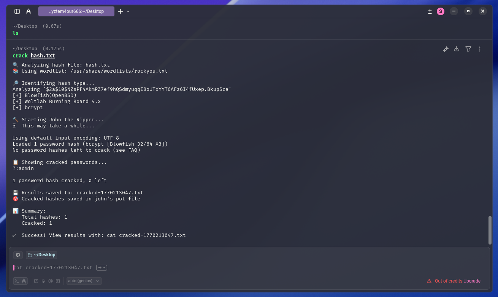

# Awesome Pentesting ZSH Functions 📦

> Collection of powerful ZSH functions designed for penetration testers, CTF players, and security researchers who value speed and efficiency.


---

## 📋 Overview

This repository contains a comprehensive suite of ZSH functions that streamline common penetration testing and CTF workflows. Each function is crafted to minimize keystrokes while maximizing efficiency, allowing you to focus on the actual security work rather than remembering complex command syntax.

All functions feature:
- 🎨 **Visual feedback** with emojis for better readability
- ⚡ **Automated workflows** that combine multiple steps
- 📁 **Organized output** with timestamped files
- 🛡️ **Error handling** with helpful usage messages

## 📦 Dependencies

### Required Tools
- **nmap** - Network scanning and enumeration
- **john** - Password hash cracking (John the Ripper)
- **zsh** - Z Shell (4.3.11 or higher)
- **gobuster** - Directory/file brute-forcing
- **ffuf** - Web fuzzing
- **hashid** - Hash type identification
- **batcat** - Syntax highlighting for output display
- **curl** - Public IP retrieval

---

```zsh
scan() {
    if [[ -z "$1" ]]; then
        echo "❌ Usage: nmapfast <target>"
        return 1
    fi
    
    local target="$1"
    local output="${2:-scan.txt}"
    
    echo "🚀 Starting fast nmap scan on $target..."
    nmap -sCV --min-rate=5000 -Pn -T4 -vvv -oN "$output" "$target"
    
    if [[ -f "$output" ]]; then
        echo "\n📋 Scan results from $output:\n"
        cat "$output"
    fi
}
```
```zsh
mkt() {
    echo "📁 Creating pentesting directory structure..."
    
    mkdir -p scans
    mkdir -p files
    mkdir -p creds
    mkdir -p exploits
    
    echo "✅ Directories created successfully!"
    echo ""
    echo "📂 Current structure:"
    ls -lah | grep "^d" | grep -E "(scans|files|creds|exploits)"
    echo ""
    echo "🎯 Ready for pentesting!"
}
```

```zsh
myip() {
    local temp_file=$(mktemp)
    
    echo " [*] IP Address Information [*]" > "$temp_file"
    echo "=========================" >> "$temp_file"
    echo "" >> "$temp_file"
    
    # Get local IP
    local local_ip=$(ip addr show | grep "inet " | grep -v "127.0.0.1" | awk '{print $2}' | cut -d'/' -f1 | head -n1)
    if [[ -n "$local_ip" ]]; then
        echo "🏠 Local IP:    $local_ip" >> "$temp_file"
    fi
    
    # Get VPN IP (tun0)
    local vpn_ip=$(ip addr show tun0 2>/dev/null | grep "inet " | awk '{print $2}' | cut -d'/' -f1)
    if [[ -n "$vpn_ip" ]]; then
        echo "🔒 VPN IP:      $vpn_ip" >> "$temp_file"
    else
        echo "🔒 VPN IP:      Not connected" >> "$temp_file"
    fi
    
    # Get public IP
    local public_ip=$(curl -s ifconfig.me 2>/dev/null)
    if [[ -n "$public_ip" ]]; then
        echo "🌍 Public IP:   $public_ip" >> "$temp_file"
    else
        echo "🌍 Public IP:   Unable to fetch" >> "$temp_file"
    fi
    
    echo "" >> "$temp_file"
    echo "📡 Network Interfaces:" >> "$temp_file"
    echo "---------------------" >> "$temp_file"
    ip -br addr show | grep -v "lo" >> "$temp_file"
    
    # Display with batcat
    cat "$temp_file"
    
    # Cleanup
    rm "$temp_file"
}
```

```zsh
# 🔓 Automated Hash Cracking Function
crack() {
    if [[ -z "$1" ]]; then
        echo "❌ Usage: crack <hash_file> [wordlist]"
        echo "📝 Example: crack hashes.txt /usr/share/wordlists/rockyou.txt"
        return 1
    fi
    
    local hash_file="$1"
    local wordlist="${2:-/usr/share/wordlists/rockyou.txt}"
    local output_file="cracked-$(date +%s).txt"
    
    # Check if hash file exists
    if [[ ! -f "$hash_file" ]]; then
        echo "❌ Error: Hash file '$hash_file' not found!"
        return 1
    fi
    
    # Check if wordlist exists
    if [[ ! -f "$wordlist" ]]; then
        echo "⚠️  Warning: Wordlist '$wordlist' not found!"
        echo "🔍 Searching for rockyou.txt..."
        wordlist=$(find /usr -name "rockyou.txt" 2>/dev/null | head -n1)
        if [[ -z "$wordlist" ]]; then
            echo "❌ No wordlist found. Please specify a valid wordlist."
            return 1
        fi
        echo "✅ Found wordlist: $wordlist"
    fi
    
    echo "🔍 Analyzing hash file: $hash_file"
    echo "📚 Using wordlist: $wordlist"
    echo ""
    
    # Identify hash type
    echo "🔎 Identifying hash type..."
    local first_hash=$(head -n1 "$hash_file")
    
    if command -v hashid &> /dev/null; then
        hashid "$first_hash"
    else
        echo "⚠️  hashid not found, attempting auto-detection with john..."
    fi
    
    echo ""
    echo "🔨 Starting John the Ripper..."
    echo "⏳ This may take a while..."
    echo ""
    
    # Run john with specified wordlist
    john --wordlist="$wordlist" "$hash_file" | tee "$output_file"
    
    echo ""
    echo "📋 Showing cracked passwords..."
    john --show "$hash_file" | tee -a "$output_file"
    
    echo ""
    echo "💾 Results saved to: $output_file"
    echo "🎯 Cracked hashes saved in john's pot file"
    
    # Display summary
    local cracked_count=$(john --show "$hash_file" 2>/dev/null | grep -c ":")
    local total_count=$(wc -l < "$hash_file")
    
    echo ""
    echo "📊 Summary:"
    echo "   Total hashes: $total_count"
    echo "   Cracked: $cracked_count"
    echo ""
    
    if [[ $cracked_count -gt 0 ]]; then
        echo "✅ Success! View results with: cat $output_file"
    else
        echo "❌ No hashes cracked. Try:"
        echo "   - Different wordlist"
        echo "   - Specify format: john --format=<type> --wordlist=$wordlist $hash_file"
        echo "   - Use hashcat for GPU cracking"
    fi
}
```

<div align="center">

---
**Made with ❤️ for the security community**

⭐ Star this repo if you find it useful!

</div>
